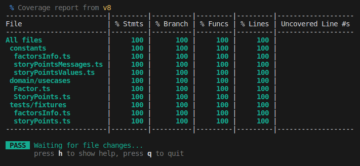

## Effortless 

#### Your story points made easy

This project consists of a story points calculator that can be used to estimate the points you need to complete a story. It is based on the following 3 factors: `complexity`, `uncertainty`, and `effort`. The story points are calculated based on the average of the factors.

- Complexity: It refers to the level of difficulty and intricacy involved in a task or feature. It can be influenced by factors such as size, dependencies, and technical challenges.
- Uncertainty: It relates to the lack of clarity or information about a task or feature. It can stem from changing requirements, limited knowledge, or external factors.
- Effort: It represents the amount of work or resources required to complete a task or feature. It includes time, skills, and resources needed to deliver the desired outcome.

## How to use

Visit it here: [Effortless](https://william-cesar.github.io/effortless)

## About

This project is developed using the following technologies:

- [React](https://reactjs.org/)
- [Vite](https://vitejs.dev/)
- [Typescript](https://www.typescriptlang.org/)
- [Tailwindcss](https://tailwindcss.com/)
- [Shadcn/ui](https://ui.shadcn.com/)
- [Vitest](https://vitest.dev/)

## Reports

> Lighthouse

---

> Unit tests

